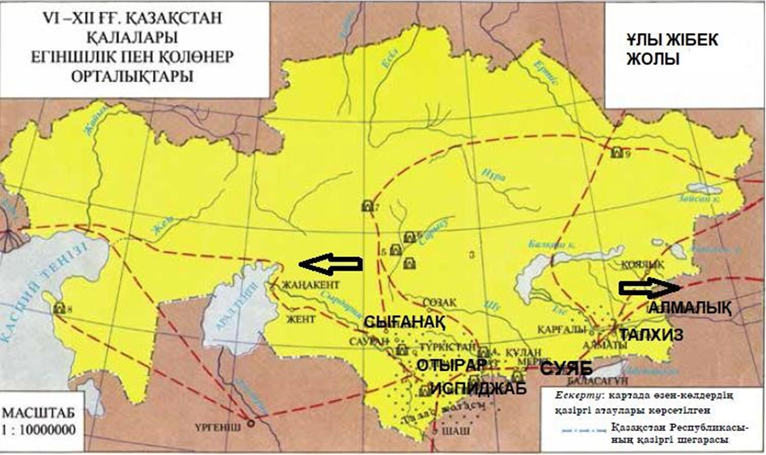

# ҰБТ «ҚАЗАҚСТАН ТАРИХЫ» — 1-нұсқа

> **Дереккөз:** e-history.kz — «Қазақстан тарихы» ұлттық порталының ҰБТ сұрақтары бөлімі (1 - нұсқа). Бұл бөлім Ұлттық тестілеу орталығымен бірлесіп дайындалған.
> <https://e-history.kz/kz/ent/kazakhstan-history/6>

> **Жауап кілті** — порталдың өз тексеру жүйесінен алынған кілт.

**Құрылымы:** 1–10 — бір дұрыс жауап · 11–15 — 1-мәнмәтін · 16–20 — 2-мәнмәтін.
Бұл — ҰТО спецификациясындағы құрылыммен толық сәйкес келетін нұсқа.

---

## 1-блок. Бір дұрыс жауапты таңдауға арналған тапсырмалар (1–10)

> *Нұсқау: Сізге берілген төрт жауап нұсқасынан бір дұрыс жауапты таңдауға арналған тапсырмалар беріледі.*

**1.** 1867-1868 жылдардағы реформалар негізінде артықшылықтары шектелген әлеуметтік топ

- **A)** әскери губернатор
- **B)** уезд бастығы
- **C)** ауыл старшыны
- **D)** сұлтандар

**2.** Түркі тілінде жазылған алғашқы энциклопедиялық еңбек

- **A)** «Масғуд кестелері»
- **B)** «Ақиқат сыйы»
- **C)** «Азаматтық саясат»
- **D)** «Құтты білік»

**3.** Кеңес үкіметі орнаған соң Қазақстанда білім беру саласында бірінші болып қолға алынған іс-шара

- **A)** Сауатсыздықты жою
- **B)** Жалпыға бірдей міндетті үш жылдық мектептер ашу
- **C)** Арнаулы кәсіптік білім беруді қолға алу
- **D)** Жоғарғы оқу орындарын ашу

**4.** 2020 жылы елімізде 175 жылдық мерейтойы аталып өтілген қазақ халқының аса көрнекті ойшылы

- **A)** Мағжан Жұмабаев
- **B)** Міржақып Дулатұлы
- **C)** Ыбырай Алтынсарин
- **D)** Абай Құнанбайұлы

**5.** Жер иеленудің иқталық жүйесін қалыптастырған мемлекет

- **A)** Қарахан
- **B)** Қыпшақ
- **C)** Қимақ
- **D)** Оғыз

**6.** XVIII ғасырдың екінші жартысында жойылған көшпелілердің соңғы империясы

- **A)** Сібір хандығы
- **B)** Моғолстан
- **C)** Бұхар хандығы
- **D)** Жоңғар хандығы

**7.** XVIII ғасырдың соңғы ширегінде Кіші жүзде хан билігін реформалауды ұсынған

- **A)** О.А. Игельстром
- **B)** В.И. Даль
- **C)** М.М. Сперанский
- **D)** А. Гейнс

**8.** Абылай ханның Ресейге бағынышты болуға ант бере отырып, Қытай елімен дипломатиялық қарым-қатынас орнатудағы басты мақсаты

- **A)** Қытайдан келетін қауіптің алдын алу
- **B)** Қытайдың әскери бекіністерін құлату
- **C)** жоңғарлардан қорғану
- **D)** қырғыздарға қарсы шабуыл жасау

**9.** XX ғ. 30-жылдары қазақтардың шетелдерге қоныс аударуына себеп болған оқиға

- **A)** дәстүрлі экономикалық саясаты
- **B)** күштеп ұжымдастыру саясаты
- **C)** әскери коммунизм саясаты
- **D)** жаңа экономикалық саясаты

**10.** Орыс князьдіктерімен тұрақты сыртқы саяси қатынастар жасаған алғашқы мемлекет

- **A)** Алтын Орда
- **B)** Мәуереннахр
- **C)** Әзірбайжан
- **D)** Мысыр

---

## 2-блок. Мәнмәтін негізіндегі тапсырмалар (11–15)

> *Нұсқау: Сізге контекст негізіндегі ұсынылған төрт жауаптан бір дұрыс жауапты таңдауға арналған тест тапсырмалары беріледі. Контексті мұқият оқып, берілген тапсырмаларға дұрыс жауап беріңіз.*

*Сурет: VI–XII ғғ. Қазақстан қалалары және Ұлы Жібек жолы картасы. Тапсырмамен бірге берілген түпнұсқа кескін.*

### Мәнмәтін

Ұлы Жібек жолыЖібек сауданың басты тауары саналды. Ғалымдардың пайымдауынша, жібек өндіру технологиясы осыдан 6000 жыл бұрын ашылған. Жібек маталарды адамдар ерте замандарда-ақ жоғары бағалаған. Жібек – жұқа, жеңіл, жұмсақ мата. Таза және табиғи болғандықтан, зарарсыздандыру қасиеті де бар. Жібек өндіруші елдер мен оны тұтынушылар жібектен тігілген киімге жәндіктердің жоламайтынын байқаған. Жібек киімдер әдемі және ыңғайлы, сәнді еді. Сондықтан жібек жасаудың құпиясы ғасырлар бойы қатаң сақталды. Қытайдан шығарылған маталар Ұлы Жібек жолы арқылы дүниежүзінің басқа аймақтарына таралып, қазынаға мол табыс әкелген... . Жібек жолы түркі бөлігінің халықаралық саудада маңызы зор еді. Ұлы Жібек жолы сауданың дамуына, көптеген қалалардың пайда болуына, өркендеуіне жол ашты. Бұл жол мемлекеттердің қалыптасуында, әлемдік өркениеттің дамуында үлкен рөл атқарды. Шығыс пен Батыс мәдениеті арасында байланыстырушы көпір саналды.

**11.** Мәнмәтінді пайдаланып, Жібек жолы бойында орналасып, Іле Алатауы етегінде транзиттік сауда орталығы болған қалаларды анықтаңыз

- **A)** Испиджаб, Отырар
- **B)** Түркістан, Тараз
- **C)** Сауран, Суяб
- **D)** Талхиз, Алмалық

**12.** Мәнмәтінді пайдаланып, Ұлы Жібек жолындағы саудада Қытайдың басты тауарын анықтаңыз

- **A)** жібек матасы
- **B)** азық-түлік
- **C)** қыш ыдыстар
- **D)** жылқы

**13.** Мәнмәтінді және тарихи білімдерді пайдаланып, Жетісудағы аса ірі сауда және әкімшілік орталығы болған қаланы анықтаңыз

- **A)** Сарайшық
- **B)** Талхиз
- **C)** Сығанақ
- **D)** Отырар

**14.** Мәнмәтінді және тарихи білімдерді пайдаланып, VI-ХІІІ ғасырлардағы Ұлы Жібек жолының негізгі дұрыс бағыттарын анықтаңыз I. Сирия – Орта Азия – Оңтүстік Қазақстан – Шу алқабы – Ыстықкөл, Шығыс Түркістан ІІ. Византия – Дербент – Маңғыстау – Арал бойы – Оңтүстік Қазақстан ІІІ. Рим – Маңғыстау – Солтүстік Қазақстан – Батыс Сібір IV. Үндістан – Каспий маңы – Шығыс Қазақстан – Византия V. Арал бойы – Сырдария бойы – Маңғыстау – Жетісу – Жапония

- **A)** І, ІІІ
- **B)** ІІІ, V
- **C)** II, IV
- **D)** І, ІІ

**15.** Карта бойынша, Ұлы Жібек жолының шығысқа шығатын қақпасын анықтаңыз

- **A)** Жетісу
- **B)** Батыс Сібір
- **C)** Маңғыстау
- **D)** Солтүстік Қазақстан

---

## 3-блок. Мәнмәтін негізіндегі тапсырмалар (16–20)

> *Нұсқау: Сізге контекст негізіндегі ұсынылған төрт жауаптан бір дұрыс жауапты таңдауға арналған тест тапсырмалары беріледі. Контексті мұқият оқып, берілген тапсырмаларға дұрыс жауап беріңіз.*

### Мәнмәтін

Түркі ақсүйектері жерленген қорғандарға құлпытастар ғасырлар бойы қойылды. Құлпытас жазуларында түркі халқының өмірлік құндылықтары мен адамгершілік мұраттары бейнеленген. Орхон және Енисей өзендері алқаптарындағы ескерткіштер түркі руна жазуының ғажайып үлгісі саналады. Ескерткіштер осы өңірден табылғандықтан «Орхон-Енисей жазуы» деп аталды. ...Барлық жазулар түркі қоғамының бүкіл жұртшылығына арналған үндеулерден тұрады. Үндеу авторлары халықты қаған маңына бірігіп, топтасуға шақырады. Білге қаған мен Күлтегін құрметіне арналған жазулар шешендік өнер мен саяси прозаның тамаша үлгілері саналады. Ағашқа оймыш (ксилография) әдісімен басып жазу да түркілердің жетістігі болып табылады. Ксилографияның шығу тегі мөрден басталады. Түркі тілінде бұл әдіс алғаш рет VII ғасырдың бас кезінде қолданылған. Ғалым С.Е. Малов өзінің «Көне түркі жазуының ескерткіштері» атты еңбегінде: «Шығыс Түркістанда қағаз өндіру, Қытайдағыдай сол кезеңде басталған» деп атап өтеді. Рунатанудың (рунология) ғылым ретіндегі екі ғасырлық тарихында еуропалық руна ескерткіштерінің бірде-бірі әлі күнге дейін оқылған жоқ. Ал сол кезеңдегі көне түркі мәтіндері қазіргі қолданыстағы сөздей жақсы оқылады.

**16.** «Көне түркі жазуының ескерткіштері» атты еңбегін жазған ғалым

- **A)** А.Герасимов
- **B)** Л.Гумилев
- **C)** С.Е.Малов
- **D)** В.Томсен

**17.** Рунатанудың ғылым ретіндегі екі ғасырлық тарихында оқылмаған ескерткіштер

- **A)** ұйғыр жазуы
- **B)** еуропалық руна
- **C)** түрік рунасы
- **D)** орыс жазуы

**18.** Мәнмәтін бойынша түркі халқының өмірлік құндылықтары мен адамгершілік мұраттары бейнеленді

- **A)** Араб жазуында
- **B)** Құлпытас жазуларында
- **C)** Төте жазуда
- **D)** Сына жазуында

**19.** Ағашқа ойып жазу әдісі

- **A)** ксилография
- **B)** генеология
- **C)** рунология
- **D)** нумерология

**20.** Мәнмәтін бойынша түркі халқының қаған маңына бірігіп топтасуға шақырған үндеуін анықтаңыз

- **A)** «Бехистун жазбалары»
- **B)** «Кодекс Куманикус»
- **C)** «Орхон-Енисей» жазбалары
- **D)** «Авеста»

---

## Жауап кілті

| № | 1 | 2 | 3 | 4 | 5 | 6 | 7 | 8 | 9 | 10 |
|---|---|---|---|---|---|---|---|---|---|---|
| **Жауап** | D | D | A | D | A | D | A | A | B | A |

| № | 11 | 12 | 13 | 14 | 15 | 16 | 17 | 18 | 19 | 20 |
|---|---|---|---|---|---|---|---|---|---|---|
| **Жауап** | D | A | B | D | A | C | B | B | A | C |
