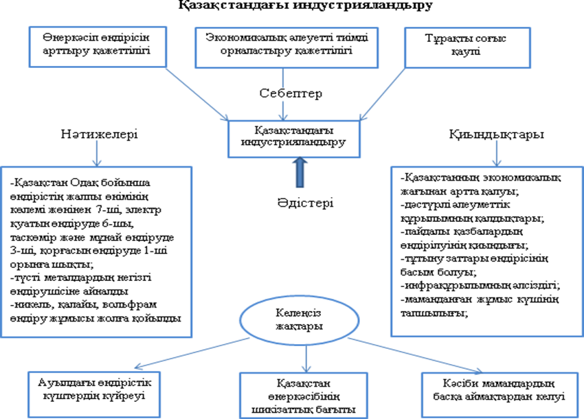

# ҰБТ «ҚАЗАҚСТАН ТАРИХЫ» — 2-нұсқа

> **Дереккөз:** e-history.kz — «Қазақстан тарихы» ұлттық порталының ҰБТ сұрақтары бөлімі (2-нұсқа). Бұл бөлім Ұлттық тестілеу орталығымен бірлесіп дайындалған.
> <https://e-history.kz/kz/ent/kazakhstan-history/12>

> **Жауап кілті** — порталдың өз тексеру жүйесінен алынған кілт.

**Құрылымы:** 1–10 — бір дұрыс жауап · 11–15 — 1-мәнмәтін · 16–20 — 2-мәнмәтін.
Бұл — ҰТО спецификациясындағы құрылыммен толық сәйкес келетін нұсқа.

---

## 1-блок. Бір дұрыс жауапты таңдауға арналған тапсырмалар (1–10)

> *Нұсқау: Сізге берілген төрт жауап нұсқасынан бір дұрыс жауапты таңдауға арналған тапсырмалар беріледі.*

**1.** Қазақстан халқының бірлігін нығайтуға бағытталған ірі қоғамдық ұйым

- **A)** Қазақстан жазушылар одағы
- **B)** Қазақстан журналистер одағы
- **C)** Қазақстан халқы Ассамблеясы
- **D)** Бала құқығын қорғау ұйымы

**2.** ХV-XVI ғасырларда жазылған «Жәмиғ-ат-тауарих» шығармасының авторы

- **A)** Әбілғазы Баһадүр
- **B)** Усман Кухистани
- **C)** Мұхаммед Хайдар Дулати
- **D)** Қадырғали Жалаири

**3.** 1841 жылы Жәңгір ханның бастамасымен ашылған мектеп

- **A)** әскери училище
- **B)** медресе
- **C)** зайырлы
- **D)** жәдидтік

**4.** «Келешек күннің болашағын білуде тарих анық құрал болады» деп көрсеткен Алаш қозғалысының көсемі

- **A)** Ә.Бөкейхан
- **B)** М.Тынышбаев
- **C)** М.Дулатұлы
- **D)** А.Байтұрсынұлы

**5.** Б.з.б. I мыңжылдықтың соңында Жетісу, Тарбағатай және Тянь-Шань аумағында құрылған мемлекет

- **A)** Сармат
- **B)** Ғұн
- **C)** Қаңлы
- **D)** Үйсін

**6.** ХVII ғасыр соңы мен ХVIIІ ғасыр басында жасалған заңдар жинағы

- **A)** «Жасақ»
- **B)** «Алтын ғасыр»
- **C)** «Есім ханның ескі жолы»
- **D)** «Жеті жарғы»

**7.** Хақназар ханнан кейін Бұхара ханының қолдауымен хан сайланған

- **A)** Бұрындық
- **B)** Қасым
- **C)** Шығай
- **D)** Тәуекел

**8.** Қарақытайлар мемлекетінің Жетісудағы саяси ықпалының күрт өзгеруіне себеп болған оқиға

- **A)** Күшліктің Жетісуға келуі
- **B)** Хорезмшахпен күрес
- **C)** Шыңғысханның жаулап алуы
- **D)** Мұсылмандарға қолдау көрсетуі

**9.** ХVIII ғасырда Ресей мемлекеті қазақ жерлерін отарлау үшін ерекше мән берді

- **A)** әскери бекіністер желісін салуға
- **B)** темір жол құрылысын жеделдетуге
- **C)** салық мөлшерін азайтуға
- **D)** өнеркәсіптер ашуға

**10.** Азия мен Еуропаның арасында Жошы ұлысында құрылған мемлекет

- **A)** Моғолстан
- **B)** Хулагу мемлекеті
- **C)** Алтын Орда
- **D)** Әмір Темір мемлекеті

---

## 2-блок. Мәнмәтін негізіндегі тапсырмалар (11–15)

> *Нұсқау: Сізге контекст негізіндегі ұсынылған төрт жауаптан бір дұрыс жауапты таңдауға арналған тест тапсырмалары беріледі. Контексті мұқият оқып, берілген тапсырмаларға дұрыс жауап беріңіз.*

*Сурет: Индустрияландыру жылдарындағы құрылыстар сызбасы. Тапсырмамен бірге берілген түпнұсқа кескін.*

### Мәнмәтін

...Индустрияландыруды бастау туралы шешім 1925 жылы желтоқсан айында БК(б)П XIV съезінде қабылданды. Мәскеудің ойынша Қазақстанжеделдете индустрияландырылған негізгіаудандардың біріне айналуытиіс болды. БК(б)П ОК саясатын белсенді Ф.И.Голощекин республикада өндірушіөнеркәсіп пен шикізаттытасып әкетуге арналғантеміржол құрылысын жақтады.Осылайша, Қазақстандағы КСРО-ныңөнеркәсіптік дамыған аймақтарының шикізат базасына айналдыру көзделді. Өндірісті дамыту үшін бірінші кезекте теміржол желілері керек болды, Алматыдан Семейге дейінгі Түркістан-Сібір (Түрксіб) теміржолының құрылысыҚазАКСР-дағы индустрияландырудың алғашқынысандарының біріне айналды.

**11.** Мәнмәтін бойынша индустрияландыру жылдары салынған теміржолды анықтаңыз

- **A)** Орал-Рязань
- **B)** Мойынты-Шу
- **C)** Түрксіб
- **D)** Орынбор-Ташкент

**12.** Мәнмәтін бойынша БК(б)П XIV съезінде қабылданған шешімді анықтаңыз

- **A)** Индустрияландыру
- **B)** Әскери коммунизм
- **C)** Ұжымдастыру
- **D)** ЖЭС

**13.** Сызбаны пайдаланып индустрияландырудың қиындықтарына жатпайтын белгілерді анықтаңыз

- **A)** дәстүрлі әлеуметтік құрылымның қалдықтары
- **B)** мамандардың тапшылығы
- **C)** табиғи ресурстардың тапшылығы
- **D)** инфрақұрылымның әлсіздігі

**14.** Мәнмәтіндегі берілген сызба бойынша Қазақстандағы индустрияландырудың келеңсіз жағын анықтаңыз

- **A)** Қорғасын өндіруден Одақ бойынша І-ші орынды иеленді
- **B)** Өнеркәсіп өндірісі артты
- **C)** Кәсіби мамандар басқа аймақтардан келді
- **D)** Түсті металдардың негізгі өндірушісіне айналды

**15.** Мәнмәтінді және тарихи білімдерді пайдаланып дұрыс дәйектерді анықтаңыз І. Ұлы Отан соғыс жылдары Қазақстан КСРО-ның ірі шикізат орталығы болды ІІ. Ұлы Отан соғыс жылдары Қазақстанда индустриаландыру басталды ІІІ. Жезқазған ауданындағы мыс кен орындарына жас инженер-геолог Қ.И. Сәтбаев барлау жүргізді ІV. Индустриаландыруды бастау туралы шешім 1926 жылы БК(б)П XV съезінде қабылданды

- **A)** І, III
- **B)** І, II
- **C)** І, ІV
- **D)** ІІ, ІV

---

## 3-блок. Мәнмәтін негізіндегі тапсырмалар (16–20)

> *Нұсқау: Сізге контекст негізіндегі ұсынылған төрт жауаптан бір дұрыс жауапты таңдауға арналған тест тапсырмалары беріледі. Контексті мұқият оқып, берілген тапсырмаларға дұрыс жауап беріңіз.*

### Мәнмәтін

Көне түркілер, түргеш, қарлұқтар заманындағы қала мен далада сәулет ескерткіштері бой көтерді. Қолданбалы және бейнелеу, мүсін өнері дамыды. Кедер мен Жамукет сарайлары (VII–ІХ ғасырлар) осының айқын мысалы болып табылады. Сарайлар мен ғибадатханаларды безендіруге сырлы сурет, өрнекті сылақ, оймыш ағаш тақтайшалар кеңіненқолданылды. Қабырғаларды әрлендіруге өсімдік және зооморфты(хайуанат пішінді) өрнектерпайдаланылды. Суяб пен Науакенттегі қазба жұмыстары кезіндебудда храмдарының орындарытабылды. Ғибадатханалардың қабырғалары сырлы суреттермен безендірілген. Қабырға қуыстары мен көтеріңкі сәкі үстінен будда мүсіндері табылған. Жамбыл облысында қарлұқ дәуірі сәулет өнерінің ескерткіші – Ақыртас ғимараты орналасқан. Оңтүстік Қазақстан облысының Қаратау баурайында VІ–VІІІ ғасырларда ортағасырлық Баладж қаласы болған. Ортағасырлық Баба-Ата жұртының орнынан археологтар VІ–VІІІ ғасырларға жататын құрылыс тапты.

**16.** Мәнмәтін бойынша теңге шығарылған Жетісудағы ортағасырлық қала

- **A)** Кедер
- **B)** Жамукет
- **C)** Науакент
- **D)** Суяб

**17.** Мәнмәтін бойынша будда храмы табылған Суяб қаласы орналасқан аймақты анықтаңыз

- **A)** Ертіс бойы
- **B)** Есіл бойы
- **C)** Маңғыстау
- **D)** Жетісу

**18.** Мәнмәтін бойынша қазба жұмыстары кезінде будда храмдарының орындары табылған қалалар

- **A)** Суяб пен Науакент
- **B)** Суяб пен Отырар
- **C)** Науакент пен Сауран
- **D)** Суяб пен Тараз

**19.** Мәнмәтін бойынша Ақыртас ғимараты орналасқан облысты анықтаңыз

- **A)** Жамбыл
- **B)** Түркістан
- **C)** Ақмола
- **D)** Қостанай

**20.** Мәнмәтін бойынша VI – VIII ғасырларға жататын Қаратау баурайындағы қала

- **A)** Суяб
- **B)** Баладж
- **C)** Отырар
- **D)** Науакент

---

## Жауап кілті

| № | 1 | 2 | 3 | 4 | 5 | 6 | 7 | 8 | 9 | 10 |
|---|---|---|---|---|---|---|---|---|---|---|
| **Жауап** | C | D | C | A | D | D | C | A | A | C |

| № | 11 | 12 | 13 | 14 | 15 | 16 | 17 | 18 | 19 | 20 |
|---|---|---|---|---|---|---|---|---|---|---|
| **Жауап** | C | A | C | C | A | D | D | A | A | B |
